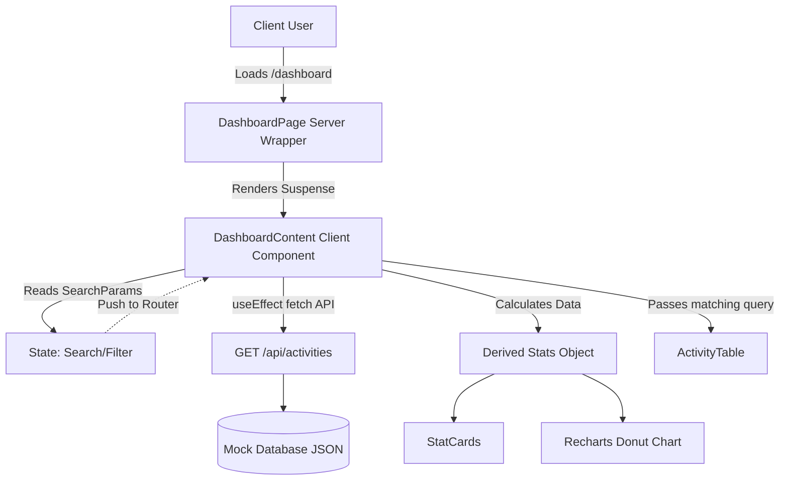

# NexCell AI Activity Dashboard

This is a Next.js 14 project demonstrating a clean, functional frontend interface for an AI Activity Dashboard.

## 1. How to run the project locally

First, ensure you have Node.js installed. Then follow these steps:

1. Setup the repository:
   ```bash
   npm install
   ```

2. Run the development server:
   ```bash
   npm run dev
   ```

3. Open your browser and navigate to: [http://localhost:3000/dashboard](http://localhost:3000/dashboard)

## 2. Assumptions & Engineering Decisions

- **URL State Synchronization**: To ensure shareability and robust user experience, the dashboard state (search query & status filters) is kept perfectly in sync with the URL parameters via Next.js `useRouter` and `useSearchParams`.
- **Client-Side vs Server-Side Data**: The initial payload is fetched via a native `fetch` call in a custom API route (`app/api/activities/route.ts`), which is ideal for a limited dataset mock. It includes an artificial `800ms` delay to showcase high-fidelity skeletons and a smooth React Suspense transition.
- **Premium UI Enhancements**: `framer-motion` is utilized for micro-layout animations to elevate the user feel. We integrated `recharts` for a dynamic visual distribution (Donut chart) of the statuses, and customized error catching with a React Error Boundary.
- **Quality Assurance**: Unit tests are built with `vitest` for reliable utility functions formatting timestamps and classmerging correctly, proving a robust deployment infrastructure.

## 3. Architecture Overview



## 4. Phased Roadmap for Future Enhancement

If this codebase continues into production at scale:

- **Phase 1: Production Data Layer**
  Transition data fetching to strongly-typed **TanStack Query** (React Query) implementations to handle deep caching, automatic background revalidation, and retry logic. Hook this up to a live relational database (e.g., PostgreSQL).
- **Phase 2: Advanced Server-Side Architecture**
  Implement Pagination limits on the API route and utilize proper server-driven filtering to scale smoothly as log sizes increase beyond thousands of rows.
- **Phase 3: Deep Observability**
  Trace UI Error boundaries into tools like Sentry, and implement deeper analytics via PostHog tracking inside the agent payloads to better understand user behavior inside the platform.
